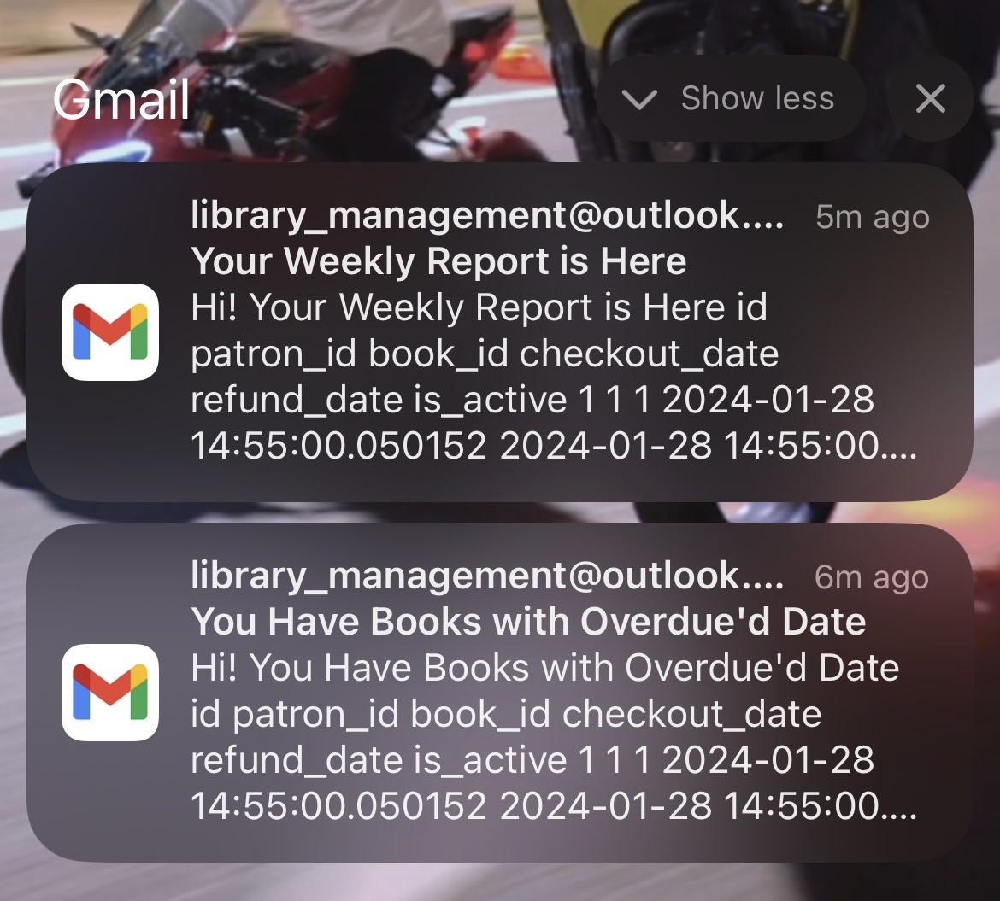

# Library Management System

This is a Library Management System developed using FastAPI, SQLAlchemy, Celery, and Redis. It allows users to manage books, patrons, checkouts, refunds, and user authentication.

## Project Structure

The project is structured as follows:

- **auth.py**: Contains authentication logic and user management functions.
- **models.py**: Defines the SQLAlchemy models for books, patrons, and checkouts.
- **schemas.py**: Defines Pydantic schemas for books, patrons, and checkouts.
- **services**:
  - **connection.py**: Manages the database connections and ORM configurations.
  - **orm.py**: Contains the ORM class for database operations.
- **tasks**:
  - **beat.py**: Defines Celery periodic tasks for overdue processes and weekly reports.
  - **mail_sender.py**: Handles sending reminder emails and weekly reports using SMTP.
- **routers**:
  - **auth.py**: Contains routers for user authentication.
  - **books.py**: Routers for managing books.
  - **checkout.py**: Routers for managing checkouts and refunds.
  - **patrons.py**: Routers for managing patrons.
  - **refund.py**: Routers for handling refunds.
- **README.md**: This file.
- **requirements.txt**: Contains the Python dependencies required by the project.

## Usage using Docker
1. You only need to run `docker-compose up --build command` and all of the hard parts will be handled by docker

## Usage for local developlent

1. Install the dependencies listed in `requirements.txt`.
2. Configure the environment variables using a `.env` file.
3. Pull redis docker image by running `docker pull redis` and then run it from docker desktop app
4. Run the FastAPI server using `DEBUG=1 uvicorn main:app --reload`.
5. This will run your app in DEBUG mode this means it will connect to local redis

## Setup

### Environment Variables

The following environment variables need to be configured:

- `DATABASE_URL`: The URL of the database.
- `REDIS_URL`: The URL of the Redis server.
- Other variables for SMTP and Celery configuration.

## Deployment

Ensure that the necessary services (database, Redis, etc.) are running and accessible before deploying the application.

## Screenshots
You can see mail screenshots below:

## Contributors

- [Yusuf Berkay Girgin](https://github.com/ybgirgin3)

## License

This project is licensed under the MIT License - see the [LICENSE](LICENSE) file for details.
